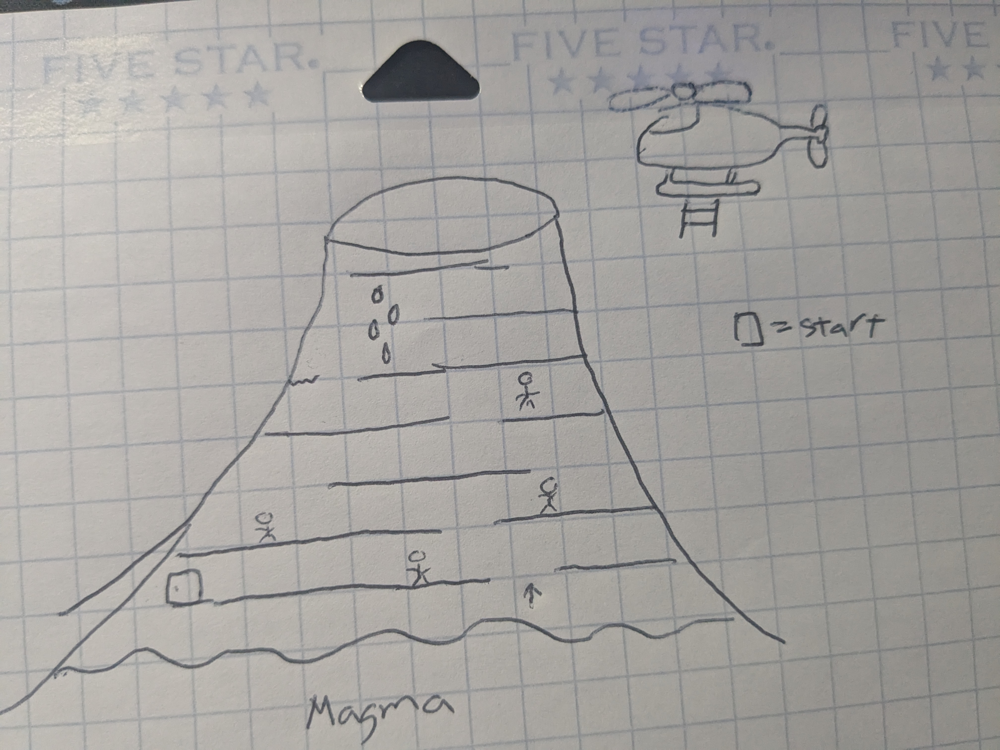
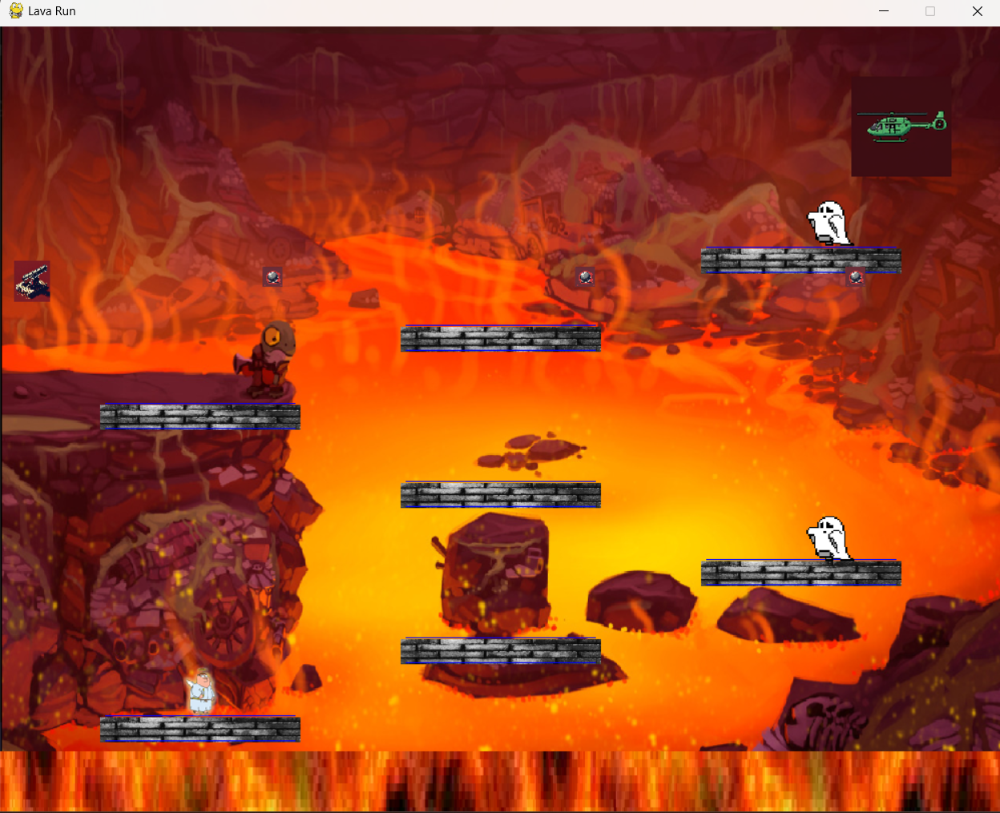

:warning: Everything between << >> needs to be replaced (remove << >> after replacing)

# Lava Run
## CS110 Final Project Fall, 2024 

## Team Members

Joyal Paul

*** 

## Project Description

There is a player that starts off at the bottom of a volcano. The objective is to get to the top and escape the volcano before the magma rises and kills the player. There are obstacles on each level of the volcano, like ghosts and cannons that repeatedly shoot out cannon balls. 
The player has limited amount of time as the lava keeps rising, and if the player gets lucky, they can fall onto a previous platfrom if it isn't already submerged in lava. If the player doesn't make it up in time, the player loses. If the player reaches the helicopter fast enough while avoiding all obstacles, the player wins. You can also see your score and the longer you take to reach the helicopter, the lower your score goes. 

***    

## GUI Design

### Initial Design

### Final Design

## Program Design

### Features

1. Moving / falling 
2. Rising lava
3. Enemies / Cannon
4. Score
5. Game over screen / Winning screen 

### Classes

- Controller - contains the mainloop that lets the game run and get called by main.
- Player - creates a player object thats able to move around, jump, and falling unless on a platform. 
- Enemies - creates enemy objects (2) that are able to move back and forth, and can kill the player.
- Cannon - creates a cannon that is used as the sorce to shoot cannon balls out, and can also kill the player.
- Shoot - shoots out multiple cannon balls that can kill the player.
- Helicopter - creates a helicopter that if the player touches, the player wins.
- Lava - creates lava that constantly rises, and can kill the player if in contact.
- Platforms - creates multiple platforms that the player is supposed to parkour on.
- Collision_plat - creates thin rectangles on the top of the platforms to see if the player landed on the top platform surface.
- Collision_plat_bottom - creates thin rectangles on the bottom of the platforms to stop player rect from entering platform rect.
- Winner - creates a winning screen that is shown if the player successfully reaches the helicopter. 
- GameOver - creates a game over screen object that is shown if the player dies before reaching the helicopter. 

## ATP
Program: "Lava Run"

Test Case 1: Movement
 - Test Description: Verifies that player movement works when going left and right.
 - Test Steps:
    1. Start Game
    2. Press "A" key.
    3. Verify that player goes left.
    4. Press "D" key.
    5. Verify that player goes right. 
 - Expected Outcome: Player moves left and right if arrow keys "A" and "D" are pressed respectively.  

Test Case 2: Player hits Lava
 - Test Description: Verifies that player hits lava and dies. 
 - Test Steps:
    1. Start Game
    2. Wait about 10 seconds for lava to rise and hit player.
    3. Player and lava hits.
    4. Verify that the player dies as player disappears.
 - Expected Outcome: Player hits lava and disappears from screen, indicating death. Game over screen is shown. 

Test Case 3: Player and Platform collisions
 - Test Description: Verifies that player is able to stand and move on top of the platform.
 - Test Steps:
    1. Start Game
    2. Wait till player lands on the top of the platform, indicated by the line above it.
    3. Verify that the player stops falling down. 
    4. Press "A" and "D".
    5. Verify the player goes left and right respectively. 
 - Expected Outcome: Player doesnt' fall and is able to move right to left respectively. 

Test Case 4: Player and border collisions
 - Test Description: Verifies that player hits borders and dies. 
 - Test Steps:
    1. Start Game
    2. Hold "W" and "A" until player hits left border.
    3. Verify player hits left border. 
    4. Verify player dies as player disappears.  
 - Expected Outcome: Player goes left, hits border, and dies as player dissapears. Game over screen is shown. 

Test Case 5: Game over Condition
 - Test Description: Verifies that game over screen is shown when player dies without reaching helicopter. 
 - Test Steps:
    1. Start Game
    2. Hold "W" and "A" until player hits left border.
    3. Verify player hits left border. 
    4. Verify player dies as it disappears.
    5. Verify game over screen shows up.  
 - Expected Outcome: Game over screen is shown after player's death. 

